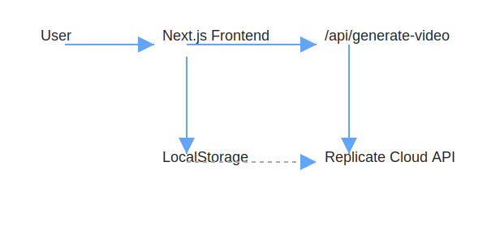
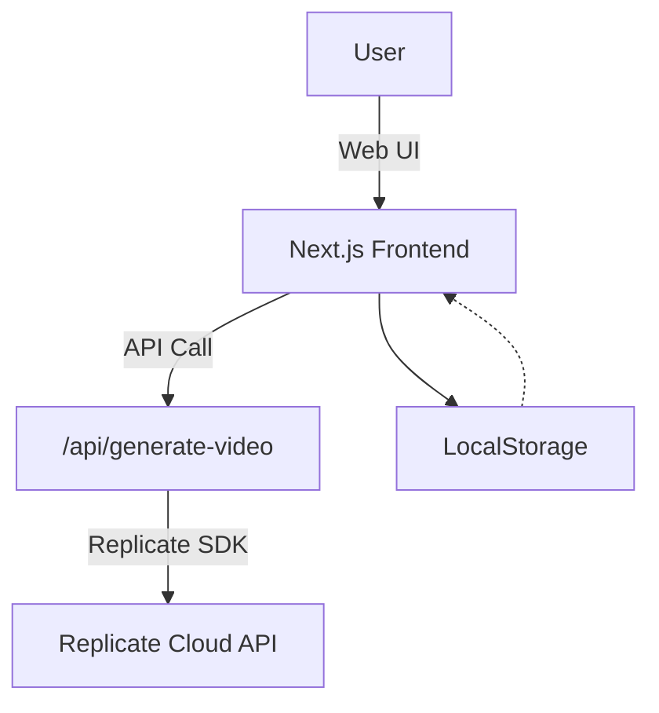
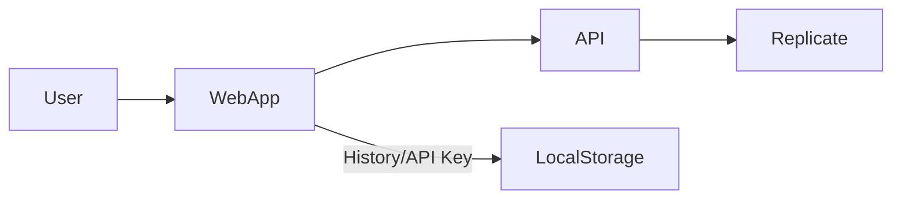
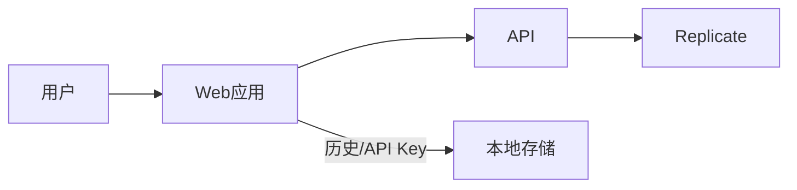

<!-- AI Video Generator Logo -->
<p align="center">
  <svg width="64" height="64" viewBox="0 0 24 24" fill="none" xmlns="http://www.w3.org/2000/svg">
    <rect width="24" height="24" rx="6" fill="#18181B"/>
    <path d="M7 7h10a2 2 0 0 1 2 2v6a2 2 0 0 1-2 2H7a2 2 0 0 1-2-2V9a2 2 0 0 1 2-2zm0 0V5m10 2V5" stroke="#60A5FA" stroke-width="1.5" stroke-linecap="round" stroke-linejoin="round"/>
    <rect x="9" y="10" width="6" height="4" rx="1" fill="#60A5FA"/>
  </svg>
</p>

<h1 align="center">AI Video Generator</h1>

<p align="center">
  <b>Transform your images into stunning videos with AI.</b><br/>
  <i>Open-source, privacy-friendly, and production-ready.</i>
</p>

---

## 🚀 Project Overview

**AI Video Generator** is a modern web application that empowers anyone to create high-quality AI-generated videos from images and text prompts—no technical skills required.

- **Core Pain Point**: Eliminate the complexity of video creation. Just upload an image, describe your idea, and get a video in minutes.
- **Use Cases**: Short video creation, advertising, education, social media, creative AI experiments, and more.
- **Competitive Advantages**:
  - 🌍 Multi-language UI (English, 中文, Español, Français, Deutsch, 日本語, 한국어)
  - 🖼️ Minimalist, mobile-friendly interface
  - 🔒 Local history, privacy-first
  - 🔑 User-supplied Replicate API Key for flexible, scalable cloud inference
  - 🛠️ Open-source, self-hostable, cost-controllable

---

## 🛠️ Installation

### Requirements
- Node.js >= 18
- npm >= 9

### Quick Start
```bash
# 1. Install dependencies
npm install

# 2. Start the development server
npm run dev

# 3. Build for production
npm run build && npm start
```

### Static Export
- The app supports static export via Next.js (`output: 'export'`).
- Deploy easily to Vercel, Netlify, or any static hosting.

---

## 🔑 Replicate API Key Setup

This project uses [Replicate](https://replicate.com/) for AI video generation. Each user must provide their own API Key for secure, scalable, and cost-effective usage.

### How to Get Your Replicate API Key
1. Register or log in at [Replicate.com](https://replicate.com/).
2. Go to [Account API Tokens](https://replicate.com/account/api-tokens).
3. Click "Create token" and copy your API Key.

### How to Use Your API Key in This App
- Click the <kbd>Settings</kbd> (gear) icon in the top-right corner.
- Open "API Settings" and paste your Replicate API Key.
- The key is securely stored in your browser's localStorage (never sent to any third party).
- You can update or remove your key at any time via the same dialog.

> **Note:** Each video generation request consumes your Replicate API quota. You control your own costs and privacy.

---

## ✨ Usage Example

1. Go to the homepage and select the <b>Generator</b> tab.
2. Upload a start image (required) and up to 4 reference images (optional).
3. Enter a prompt (what you want to see in the video) and a negative prompt (what to avoid, optional).
4. Choose aspect ratio and CFG Scale.
5. Click <b>Generate Video</b>.
6. Download the result or manage your history in the <b>History</b> tab.

---

## 🎬 Demo


---

## 🏗️ Technical Architecture

> **Note:** If the diagram below does not render, please use a Markdown editor with Mermaid support (e.g., VS Code with Mermaid plugin, Typora, Obsidian), or view the SVG image below.





---

## 🗺️ Functional Architecture (Service Topology)



---

## 🏢 Production Deployment Guide

- **Cloud Integration**: Recommended on Vercel, Netlify, or any Node.js-compatible cloud.
- **Monitoring & Logging**: Use built-in Vercel/Netlify monitoring, or integrate with your own logging solution.
- **Cost Optimization**: Each user brings their own Replicate API Key, so costs are usage-based and distributed. No backend server costs for video inference.
- **Environment Variables**: None required for basic use; all sensitive data is user-side.

---

## 🤝 Contributing & Maintenance

- **Contributing**: PRs welcome! Please follow Conventional Commits and open issues for discussion.
- **Testing**: Manual testing is currently used. Automated tests are welcome as contributions.
- **FAQ**:
  - <b>Where do I get a Replicate API Key?</b> See above.
  - <b>What image formats are supported?</b> JPG, PNG, WebP (max 10MB).
  - <b>Why is video generation slow?</b> Depends on Replicate queue and your API quota.
  - <b>Is my API Key safe?</b> Yes, it's only stored in your browser.

---

## 📄 License

This project is licensed under the MIT License. See [LICENSE](./LICENSE) for details.

---

<details>
<summary><b>简体中文版本（点击展开）</b></summary>

<!-- Logo SVG 可复用上方 -->

<h1 align="center">AI 视频生成器</h1>

<p align="center">
  <b>用 AI 将图片转化为精美视频。</b><br/>
  <i>开源、隐私友好、生产可用。</i>
</p>

---

## 🚀 项目简介

**AI 视频生成器** 是一款现代化 Web 应用，让任何人都能用图片和文本提示词，轻松生成高质量 AI 视频，无需技术门槛。

- **核心痛点**：消除视频创作门槛，上传图片+描述，几分钟生成视频。
- **适用场景**：短视频、广告、教育、社交媒体、AI 创意实验等。
- **对比优势**：
  - 🌍 多语言界面（支持中英等七种语言）
  - 🖼️ 极简 UI，移动端适配
  - 🔒 本地历史记录，隐私友好
  - 🔑 用户自带 Replicate API Key，灵活扩展
  - 🛠️ 开源可自部署，成本可控

---

## 🛠️ 安装说明

### 环境要求
- Node.js >= 18
- npm >= 9

### 快速开始
```bash
npm install
npm run dev
# 构建生产包
npm run build && npm start
```

### 静态导出
- 已支持 Next.js 静态导出，可部署到 Vercel、Netlify 或任意静态托管。

---

## 🔑 Replicate API Key 配置

本项目通过 [Replicate](https://replicate.com/) 实现 AI 视频生成。每位用户需自备 API Key，安全灵活、成本可控。

### 获取 API Key
1. 注册或登录 [Replicate.com](https://replicate.com/)
2. 访问 [API Tokens](https://replicate.com/account/api-tokens)
3. 点击"Create token"，复制 API Key

### 在本应用中使用
- 点击右上角 <kbd>设置</kbd> 图标，进入"API 设置"
- 粘贴 API Key，保存即可
- 密钥仅存储在本地浏览器，不上传服务器
- 可随时修改或删除

> **注意**：每次生成视频会消耗你的 Replicate API 配额，费用自理。

---

## ✨ 使用示例

1. 进入首页，选择"生成器"标签
2. 上传起始图片（必选），可选上传参考图片
3. 填写提示词和负面提示词
4. 选择比例和 CFG Scale
5. 点击"生成视频"
6. 下载结果或在"历史记录"中管理

---

## 🎬 Demo


---

## 🏗️ 技术架构图

> **Note:** If the diagram below does not render, please use a Markdown editor with Mermaid support (e.g., VS Code with Mermaid plugin, Typora, Obsidian), or view the SVG image below.


```mermaid
flowchart TD
  A[用户] -->|Web界面| B(Next.js 前端)
  B -->|API 调用| C[/api/generate-video]
  C -->|Replicate SDK| D[Replicate 云API]
  B --> E[本地存储]
  E -.-> B
```

---

## 🗺️ 功能架构图（服务拓扑）



---

## 🏢 生产部署指南

- **云服务集成**：推荐 Vercel、Netlify 或自建 Node 环境
- **监控与日志**：可用云平台自带监控，或自集成日志方案
- **成本优化**：用户自带 API Key，费用自理，无需自建推理后端
- **环境变量**：基础使用无需配置，所有敏感信息仅本地存储

---

## 🤝 贡献与维护

- **贡献指南**：欢迎 PR，建议遵循 Conventional Commits
- **测试说明**：目前以手动测试为主，欢迎补充自动化测试
- **常见问题**：API Key 获取、图片格式、生成慢等

---

## 📄 许可证

MIT License

</details> 